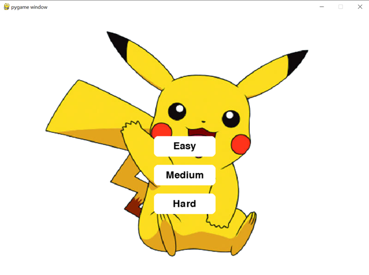
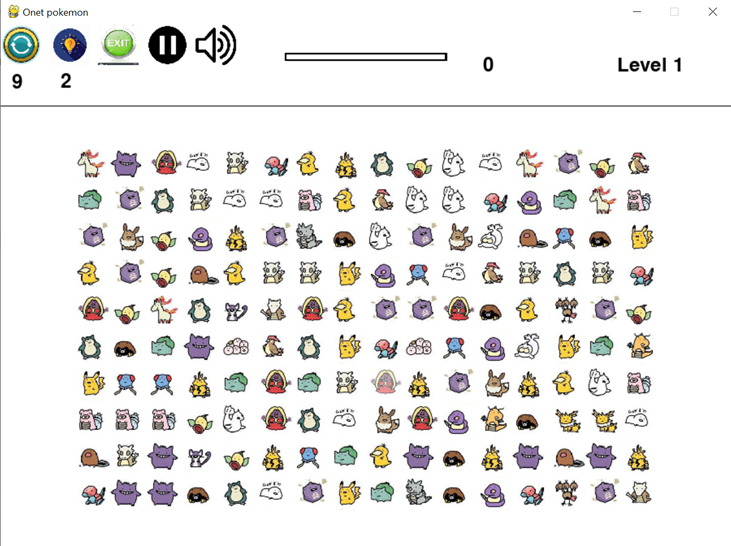
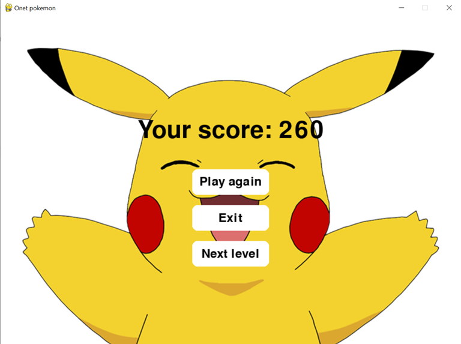
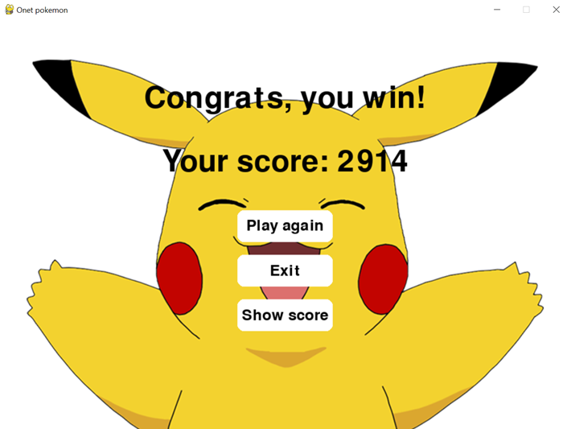
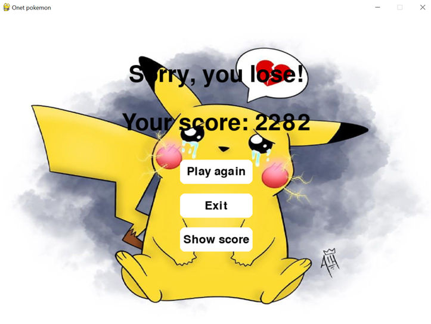

# GAME NỐI THÚ POKEMON
### Lịch sử
Trò chơi "Nối thú Pokémon" là một trò chơi điện tử giải đố được phát hành bởi hãng game Nhật Bản là Genius Sonority vào ngày 18/02/2015. Trò chơi này được xây dựng trên thế giới nhân vật của hoạt hình Pokémon nổi tiếng. Genius Sonority là một công ty phát triển trò chơi có trụ sở tại Tokyo, Nhật Bản. Họ đã tạo ra nhiều trò chơi dựa trên thương hiệu Pokémon và đã góp phần làm phong phú thêm hệ thống game của thế giới Pokémon. Trò chơi "Nối thú Pokémon" là một trong những sản phẩm của hãng, mang đến trải nghiệm giải đố thú vị và hấp dẫn cho người chơi.
### Mô tả
Trò chơi "Nối thú Pokémon" là một trò chơi nối 2 hình ảnh Pokémon giống nhau và xóa chúng đi, với điều kiện đường nối 2 hình ảnh Pokémon có số lần gấp khúc không quá 2. Đường nối không được vượt qua bất kỳ hình ảnh hoặc vật cản nào khác và chỉ được di chuyển theo hàng ngang hoặc hàng dọc, không được đi chéo.

Trò chơi cung cấp nhiều cách sắp xếp Pokémon khác nhau, bao gồm đứng yên, lên trên, xuống dưới, sang trái, sang phải, về giữa và theo đường chéo. Mỗi cấp độ tương ứng với một cách sắp xếp Pokémon.
Sau mỗi lần xóa Pokémon thành công, nếu không còn cặp Pokémon nào có thể xóa, các hình ảnh Pokémon sẽ được sắp xếp lại tự động (số lần sắp xếp lại vị trí giới hạn là 9). Trò chơi cũng cung cấp gợi ý về cặp Pokémon có thể xóa (số lần gợi ý giới hạn là 2).

Trò chơi kết thúc trong các trường hợp sau: hết thời gian quy định, không còn khả năng sắp xếp lại vị trí hoặc đã chơi hết tất cả các cấp độ. Người chơi có thể lựa chọn chơi lại cấp độ đã hoàn thành sau mỗi cấp độ.

Điểm số được tính dựa trên số cặp Pokémon đã xóa và thời gian còn lại sau mỗi cấp độ. Công thức tính điểm là: Điểm=(số cặp đã xóa)*10+(thời gian còn lại ở mỗi cấp độ)*2.

Giao diện trò chơi bao gồm một lưới các hình ảnh Pokémon, hiển thị điểm số, nút sắp xếp lại vị trí, nút gợi ý và hiển thị thời gian.

## KẾT QUẢ NGHIÊN CỨU
### TÌM ĐƯỜNG ĐI ĐỂ NỐI 2 POKEMON BẰNG BFS
#### Mục đích
Khi chọn 2 ô pokemon $a$ và $b$ giống nhau, để xem 2 ô có thể nối được với nhau hay không, cần phải thỏa mãn điều kiện đường gấp khúc khi đi từ a đến b không vượt quá 2 lần. Nói cách khác đường đi từ $a$ đến $b$ không có quá 3 đường thẳng. Ta cần sử dụng thuật toán BFS để tìm xem liệu có tồn tại đường đi từ $a$ đến $b$ thỏa điều kiện không
#### Ý tưởng
Gọi $a$ tọa độ $(xStart, yStart)$ là ô bắt đầu, $b$ tọa độ $(xEnd, xEnd)$ là ô kết thúc. 

Gọi $f_{x,y,dir}$ để lưu giá trị đường thẳng của đường nối khi đi từ $a$ đến ô $(x,y)$ với là $dir$. Nếu từ $a$ đến $b$ tồn tại đường đi có dưới $3$ đoạn thẳng thì 2 ô có thể nối với nhau.

**Bước 1**: Gán giá trị ban đầu cho $f_{xStart,yStart,dir} = 1$ và thêm tuple $(xStart,yStart,dir)$ vào hàng đợi.

**Bước 2**: Lấy tuple $t$ là phần tử đầu ra khỏi hàng đợi.

**Bước 3:** Kiểm tra điều kiện dừng: nếu tọa độ của $t$ trùng khớp với tọa độ điểm $b$ và $f_{t_0, t_1, t_2} \in [1,3]$ , đi đến **bước 5**

**Bước 4:**
- Duyệt qua 4 hướng di chuyển và tính toán tọa độ mới $(x, y)$ dựa trên tọa độ hiện tại và hướng di chuyển.
- Kiểm tra xem tọa độ mới có nằm trong giới hạn của lưới và có thể di chuyển vào ô đó không.
- Nếu điều kiện được thỏa mãn, kiểm tra hướng di chuyển.
- Nếu hướng di chuyển khác với hướng di chuyển của ô hiện tại và $f_{x,y,dir} > f_{t_0,t_1,t_2} + 1$, cập nhật $f_{x,y,dir}$ và thêm tupple $(x, y, dir)$ hàng đợi.
- Nếu hướng di chuyển trùng khớp với hướng di chuyển của ô hiện tại và $f_{x,y,dir} > f_{t_0,t_1,t_2}$, cập nhật $f_{x,y,dir}$ và thêm tọa độ mới và hướng di chuyển vào đầu hàng đợi.
- Cập nhật mảng trace với tọa độ nguồn của tọa độ mới.

**Bước 5:** Sau khi kết thúc vòng lặp, duyệt qua 4 hướng di chuyển và kiểm tra xem có đường đi từ Cell sau đến các điểm khác hay không, nếu có thì thực hiện cập nhật đường đi và hình vẽ nối đường đi $(flag=True)$.

#### Chương trình tìm đường nối giữa hai pokemon

<details>

<summary>Code python</summary>

```python

def has_path(self, a:Cell, b:Cell, flag):
      f = [[[self.INT_MAX] * 4 for _ in range(self.N_COL + 2)] for _ in range(self.N_ROW + 2)]
      trace = [[[(-1, -1, -1)] * 4 for _ in range(self.N_COL + 2)] for _ in range(self.N_ROW + 2)]
      queue = []
      d = [(1, 0), (0, 1), (-1, 0), (0, -1)]
      
      x_start, y_start, x_end, y_end = a.r, a.c, b.r, b.c
      
      for dir in range(4):
        f[x_start][y_start][dir] = 1
        queue.append((x_start, y_start, dir))

      while len(queue) > 0:
        t = queue[0]
        queue.pop(0)
        if (t[0], t[1]) == (x_end, y_end) and 1 <= f[t[0]][t[1]][t[2]] <= 3: break
        for dir, t1 in enumerate(d):
          x = t[0] + t1[0]
          y = t[1] + t1[1]
          if self.inside(x, y) and (self.cell[x][y].val_pokemon == 0 or (x, y) == (x_end, y_end)): 
            if dir != t[2] and f[x][y][dir] > f[t[0]][t[1]][t[2]] + 1:
              f[x][y][dir] = f[t[0]][t[1]][t[2]] + 1
              queue.append((x, y, dir))
              trace[x][y][dir] = (t[0], t[1], t[2])
            if dir == t[2] and f[x][y][dir] > f[t[0]][t[1]][t[2]]:
              f[x][y][dir] = f[t[0]][t[1]][t[2]]
              queue.insert(0, (x, y, dir))
              trace[x][y][dir] = (t[0], t[1], t[2]) 

      for dir in range(4):
        if 1 <= f[x_end][y_end][dir] <= 3:
          if flag == True:
            x, y, d = x_end, y_end, dir
            while True:
              t0 = (x, y, d)                    
              t1 = trace[x][y][d]             
              t2 = trace[t1[0]][t1[1]][t1[2]]
              if (t1[0], t1[1]) == (x_start, y_start): 
                return True
              v1 = (t1[0]-t0[0], t1[1]-t0[1]) 
              v2 = (t2[0]-t1[0], t2[1]-t1[1]) 
              val = self.get_path_value(v1, v2)
              self.cell[t1[0]][t1[1]].update_path_val(val, self.img_line_path[val])
              self.delete_queue.append((time.time(), self.cell[t1[0]][t1[1]]))
              x, y, d = t1[0], t1[1], t1[2]

          return True
        
      return False 

3.2 XÓA CẶP POKEMON
def delete_cell(self):
while len(self.delete_queue) > 0:
        t = self.delete_queue[0]
        if(time.time() - t[0] > self.delete_time_wait):
          if len(t) == 3:
            self.change_state(self.level, t[1], t[2])
          else:
            t[1].delete() 
          self.delete_queue.pop(0)
        else:
          Return

 def change_state(self, level:int, c1:Cell, c2:Cell):
      
      if level == 0:
        c1.delete()
        c2.delete()

      elif level == 1: #rot xuong
        self.fall_down1(c1, c2)

      elif level == 2: #rot len
        self.fall_up1(c1, c2)

      elif level == 3: #rot trai
        self.fall_left1(c1, c2)

      elif level == 4: #rot phai
        self.fall_right1(c1, c2)

      elif level == 5: #rot vo giua theo chieu ngang
        if 2*c1.r <= self.N_ROW and 2*c2.r <= self.N_ROW:
          self.fall_down1(c1, c2)
        elif 2*c1.r > self.N_ROW and 2*c2.r > self.N_ROW:
          self.fall_up1(c1, c2)
        else:
          if c1.r < c2.r:
            self.fall_down(c1)
            self.fall_up(c2)
          else:
            self.fall_up(c1)
            self.fall_down(c2)
      
      elif level == 6: #rot vo giua theo chieu doc
        if 2*c1.c <= self.N_COL and 2*c2.c <= self.N_COL:
          self.fall_right1(c1, c2)
        elif 2*c1.c > self.N_COL and 2*c2.c > self.N_COL:
          self.fall_left1(c1, c2)
        else:
          if c1.c < c2.c:
            self.fall_right(c1)
            self.fall_left(c2)
          else:
            self.fall_left(c1)
            self.fall_right(c2)
        
      elif level == 7: #rot sang 2 ben theo chieu doc
        if 2*c1.c <= self.N_COL and 2*c2.c <= self.N_COL:
          self.fall_left1(c1, c2, False)
        elif 2*c1.c > self.N_COL and 2*c2.c > self.N_COL:
          self.fall_right1(c1, c2, False)
        else:
          if c1.c < c2.c:
            self.fall_left(c1, False)
            self.fall_right(c2, False)
          else:
            self.fall_right(c1, False)
            self.fall_left(c2, False)

      elif level == 8: #rot 2 ben theo chieu ngang
        if 2*c1.r <= self.N_ROW and 2*c2.r <= self.N_ROW:
          self.fall_up1(c1, c2, False)
        elif 2*c1.r > self.N_ROW and 2*c2.r > self.N_ROW:
          self.fall_down1(c1, c2, False)
        else:
          if c1.r < c2.r:
            self.fall_up(c1, False)
            self.fall_down(c2, False)
          else:
            self.fall_down(c1, False)
            self.fall_up(c2, False)
      
      elif level == 9:
        self.fall_left_up1(c1, c2)
      
      elif level == 10:
        self.fall_left_down1(c1, c2)
        
      elif level == 11:
        self.fall_right_up1(c1, c2)
        
      elif level == 12:
        self.fall_right_down1(c1, c2)
      
      if c2.val_pokemon:
        c2.set_chosen(False)
        c2.set_can_click(True)
        c2.unclick()
      if c1.val_pokemon:  
        c1.set_chosen(False)
        c1.set_can_click(True)
        c1.unclick()

      self.current_cell -= 2
      if self.is_sound:
        self.sound_conected.play()
```
</details>

### Giao diện 
#### Màn hình trang chủ

#### Màn hình trong game

#### Giao diện để chuyển sang level tiếp theo

#### Màn hình chiến thẳng

#### Màn hình thua


### TÀI LIỆU THAM KHẢO
1. David J.Malan, CS50’s Introduction to Programming with Python, 1/12/2023, https://cs50.harvard.edu/python/2022/

2. Jon Finder, Pygame: A Primer on Game Programming in Python, 1/12/2023, https://realpython.com/pygame-a-primer/

3. Nguyễn Văn Hiếu (2023), Hàng đợi – Queue, 12/12/2023,  https://nguyenvanhieu.vn/hang-doi-queue/
